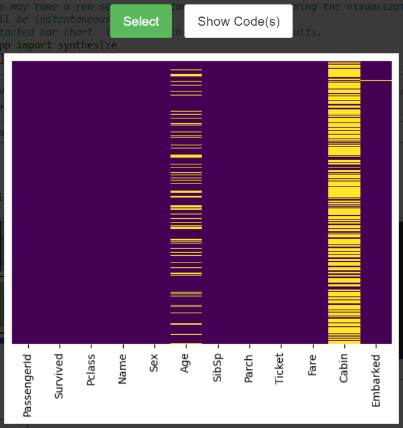

#  VizSmith Demo

Run the binder link below to access the demo.

## Examples

### 1. Motivating Example in Paper - Normalized Stacked Bar Chart

#### Search Results

#### Zoomed-in View of Best-Matching Visualization

### 2. Visualizing Correlation

#### Search Results

#### Zoomed-in View of Best-Matching Visualization

### 3. Counts as a Pie-Chart

#### Search Results

#### Zoomed-in View of Best-Matching Visualization

### 4. Scatter Plot

#### Search Results

#### Zoomed-in View of Best-Matching Visualization

### 5. Word-clouds of Text Columns

#### Search Results

#### Zoomed-in View of Best-Matching Visualization

### 6. Visualizing Missing Values

#### Search Results

#### Zoomed-in View of Best-Matching Visualization

